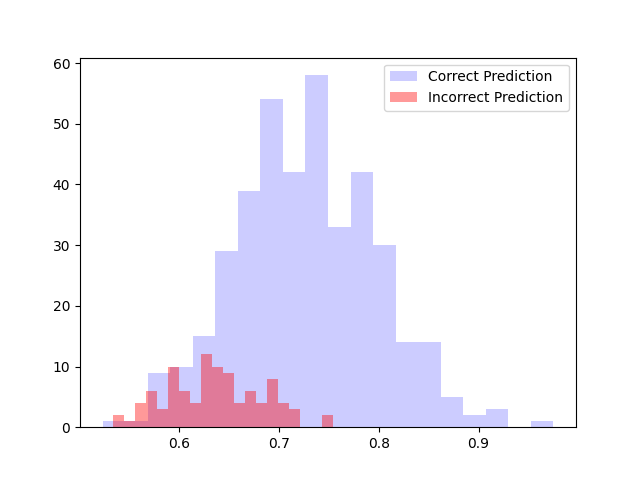

# Benchmark results 

## Deepstack command 
docker run -e VISION-DETECTION=True -e VISION-FACE=True -v localstorage:/datastore -p 80:5000 deepquestai/deepstack

Make sure to edit the GLOBAL variables in the notebook if the deepstack command is different (i.e -p is set for anything other than 80:5000)

**Warning**: Running this benchmark will delete all the saved faces in the deepstack

# Benchmarks 

## Family-wide benchmark

The most likely scenario is using the software in a family of 3-5 people 
To simulate this, I trained 4 individuals using a variable number of photos and then tried to perform recognition. 

I also checked what was the performance using photos from new individuals

### Pipeline 

- Step 1 - Pick 4 random individuals, and train deepstack to recognize them (with a variables number of images)
- Step 2 - Test using photos from the same individuals. The prediction is correct if the predicted and the test label are the same
- Step 3 - Compute metrics (Explained below)
- Step 4 - Test on 100 photos of new individuals (not registered). In this case a correct prediction would be one where there is not a predicted face (using a treshold)
- Step 5 - Delete trained faces and repeat the process 25 times

Accuracy = (TP + TN) / (TP + TN + FP + FN)
Precision = TP / (TP + FP)
Recall = TP / (TP + FN)
F1-Score = 2 * (precision * recall) / (precision + recall)

### Training using one photo

Use only one photo per person: 

Histograms of confidance shows higher scores when the face is predicted correctly (blue)

Performance: 

| Metrics/Treshold         	| 0    	| 0.8     	|
|--------------------------	|------	|---------	|
| Accuracy                 	| 0.33 	| 0.67    	|
| Precision                	| 0.63 	| 0.74    	|
| Recall                   	| 0.33 	| 0.67    	|
| F1-Score                 	| 0.40 	| 0.69    	|
| Number of photos removed 	| N.A  	| 415 / 508	|

### Training using Five photos

Use only one photo per person: 

Histograms of confidance shows higher scores when the face is predicted correctly (blue)

Performance: 

| Metrics/Treshold         	| 0    	| 0.8     	|
|--------------------------	|------	|---------	|
| Accuracy                 	| 0.30 	| 0.73    	|
| Precision                	| 0.62 	| 0.80    	|
| Recall                   	| 0.30 	| 0.73    	|
| F1-Score                 	| 0.38 	| 0.76    	|
| Number of photos removed 	| N.A  	| 423 / 507 |

### Training using 15 photos

Use only one photo per person: 

Histograms of confidance shows higher scores when the face is predicted correctly (blue)

Performance: 

| Metrics/Treshold         	| 0    	| 0.8     	|
|--------------------------	|------	|---------	|
| Accuracy                 	| 0.31 	| 0.70    	|
| Precision                	| 0.63 	| 0.75    	|
| Recall                   	| 0.30 	| 0.70    	|
| F1-Score                 	| 0.39 	| 0.72    	|
| Number of photos removed 	| N.A  	| 417 / 507 |

I still need to make some improvements (for example in new photos, since the results are weird, but this show that even increasing the number of photos used to train, the results are always the same)