# Benchmark results 

## compreFace command 

docker-compose up 

**Note**: The docker file is provided in this repository

**Warning**: Running this benchmark will delete all the saved faces in the deepstack

# Benchmarks 

## Family-wide benchmark

The most likely scenario is using the software in a family of 3-5 people 
To simulate this, I trained 4 individuals using a variable number of photos and then tried to perform recognition. 

I also checked what was the performance using photos from new individuals

### Pipeline 

- Step 1 - Pick 4 random individuals, and train deepstack to recognize them (with a variables number of images)
- Step 2 - Test using photos from the same individuals. The prediction is correct if the predicted and the test label are the same
- Step 3 - Compute metrics (Explained below)
- Step 4 - Test on 100 photos of new individuals (not registered). In this case a correct prediction would be one where there is not a predicted face (using a treshold)
- Step 5 - Delete trained faces and repeat the process 25 times

Accuracy = (TP + TN) / (TP + TN + FP + FN)
Precision = TP / (TP + FP)
Recall = TP / (TP + FN)
F1-Score = 2 * (precision * recall) / (precision + recall)

### Training using one photo

Use only one photo per person: 

Histogram of correct vs histogram of incorrect confidance

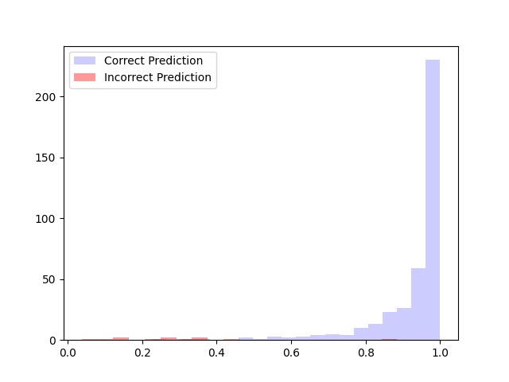

Metrics with increasing confidance 

<table>
  <tr>
    <td>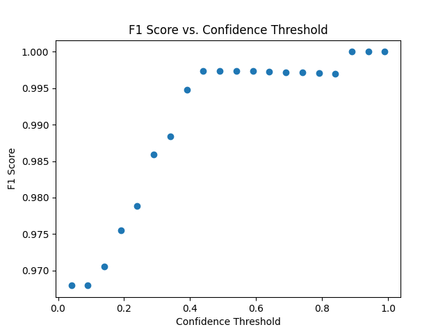</td>
    <td>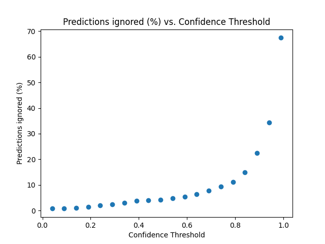</td>
  </tr>
 </table>

(Other metrics are avaiable in the report_figure_folder)

<table>
  <tr>
    <td>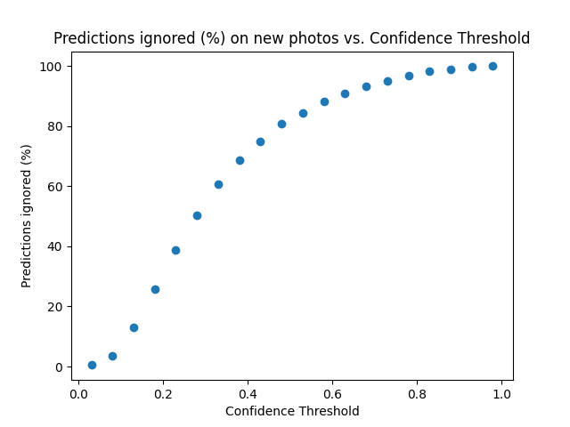</td>
    <td>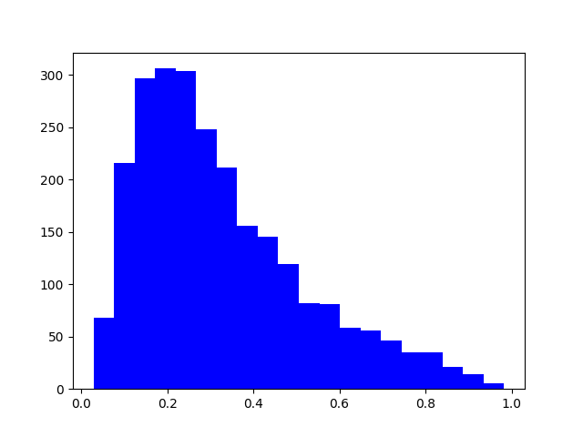</td>
  </tr>
 </table>

### Training using Five photos

Use only 5 photo per person: 

Histogram of correct vs histogram of incorrect confidance

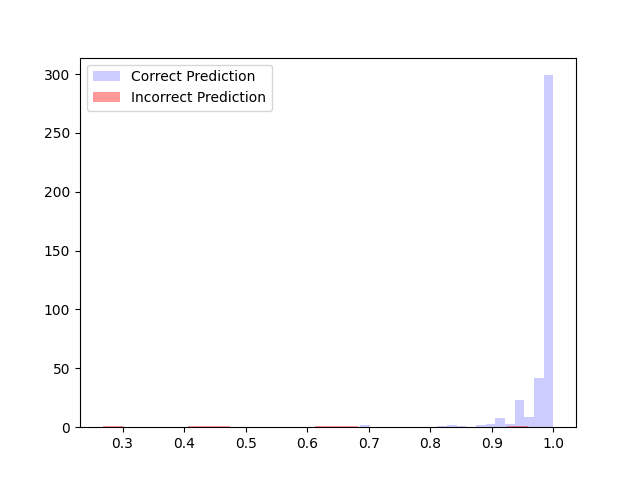

Metrics with increasing confidance 

<table>
  <tr>
    <td>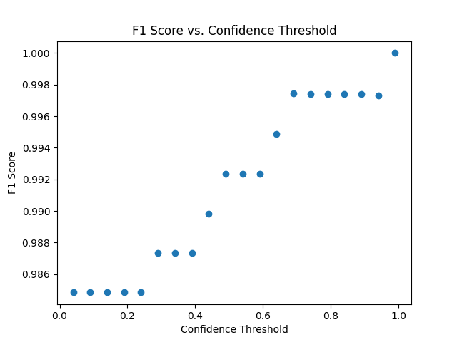</td>
    <td>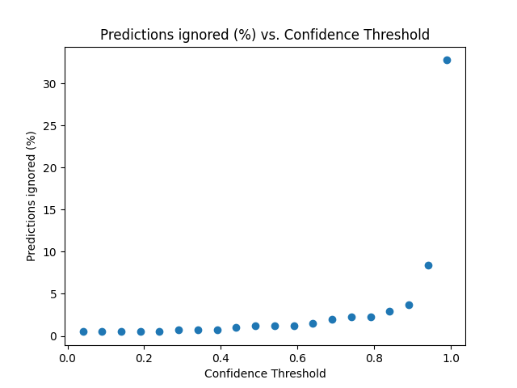</td>
  </tr>
 </table>

(Other metrics are avaiable in the report_figure_folder)

<table>
  <tr>
    <td>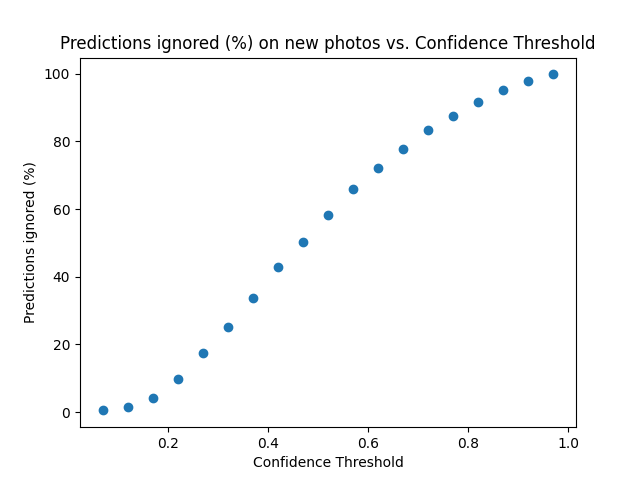</td>
    <td>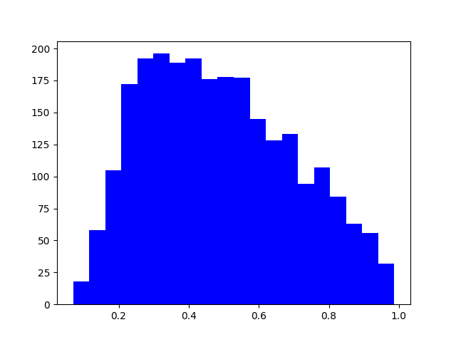</td>
  </tr>
</table>

### Training using 20 photos

Use only 20 photo per person: 

Histogram of correct vs histogram of incorrect confidance

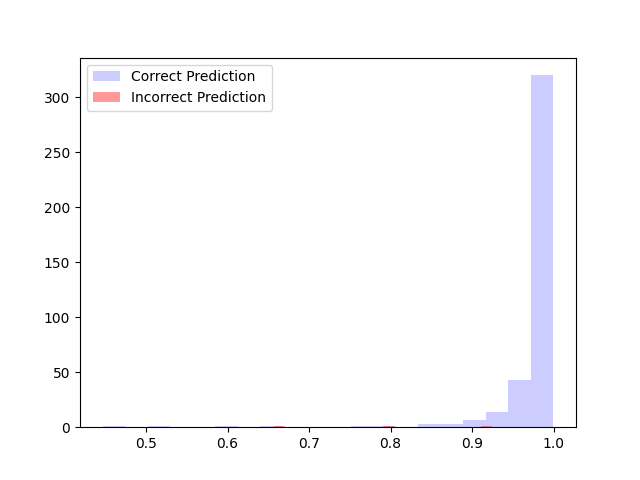

Metrics with increasing confidance 

<table>
  <tr>
    <td>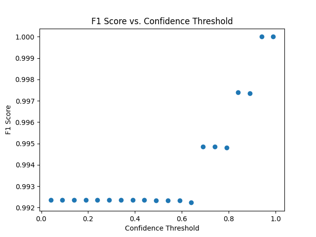</td>
    <td>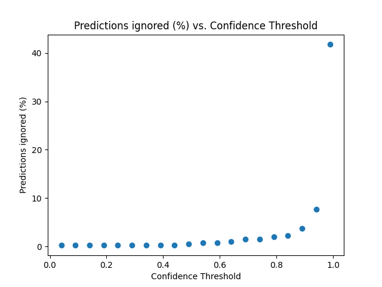</td>
  </tr>
 </table>

(Other metrics are avaiable in the report_figure_folder)

<table>
  <tr>
    <td>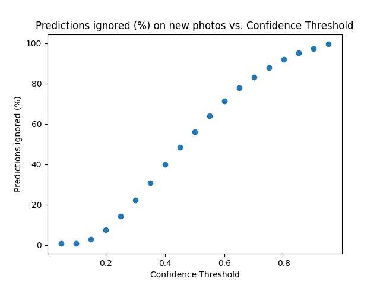</td>
    <td>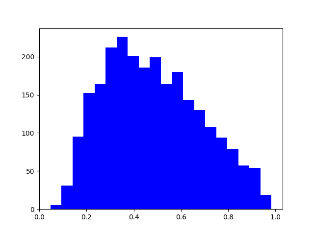</td>
  </tr>
</table>

| Metric/Model                	| One photo - min_confidance = 0 	| One photo - min_confidance = 0.6 	| Five photo - min_confidance = 0 	| Five photo - min_confidance = 0.62 	| 15 photo - min_confidance = 0 	| 15 photo - min_confidance = 0.6 	|
|-----------------------------	|--------------------------------	|----------------------------------	|---------------------------------	|------------------------------------	|-------------------------------	|---------------------------------	|
| Accuracy                    	| 0.972                          	| 0.99                             	| 0.985                           	| 0.99                               	| 0.99                          	| 0.99                            	|
| F1-score                    	| 0.967                          	| 0.99                             	| 0.984                           	| 0.99                               	| 0.99                          	| 0.99                            	|
| Precision                   	| 0.970                          	| 0.99                             	| 0.985                           	| 0.99                               	| 0.99                          	| 0.99                            	|
| Recall                      	| 0.972                          	| 0.99                             	| 0.987                           	| 0.99                               	| 0.99                          	| 0.99                            	|
| prediction ignored (%)      	| 0.7%                           	| 5.4%                             	| 0.49%                           	| 1.24%                              	| 0.25%                         	| 0.75                            	|
| New individuals ingored (%) 	| 0.47%                          	| 88.14%                           	| 0.51%                           	| 72.19%                             	| 0.636%                        	| 71.36%                          	|

## Discussion 

- There are some limitations in this benchmark: Photos are pre-cut, meaning that we are not testing the capabilities of the algorithm to capture the face itself, only to identify. 
- No care was taken in relation to different etnic groups

## Conclusions 

- Training with more images has a marginal effect on the performance (Training with up to five photos is more than enough)
- Applying a cuttoff is advised, if we are trying to prioritize not capturing people unknown. In this case, it seems to be better to train with only one photo (Not sure why)
