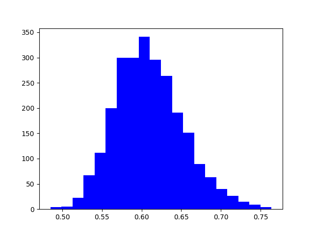
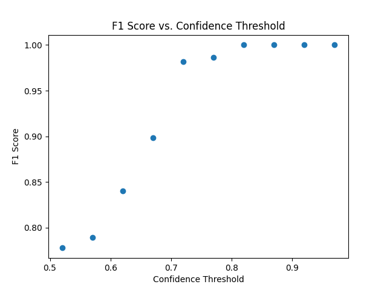
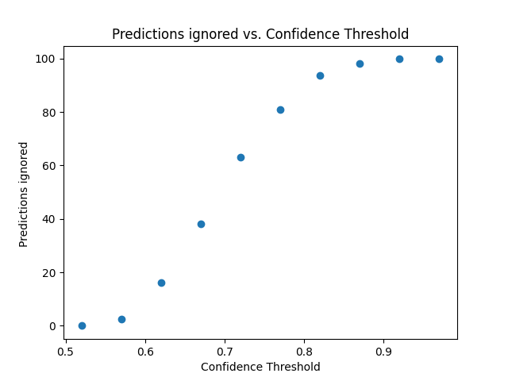
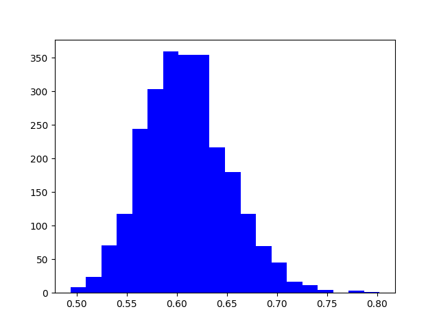
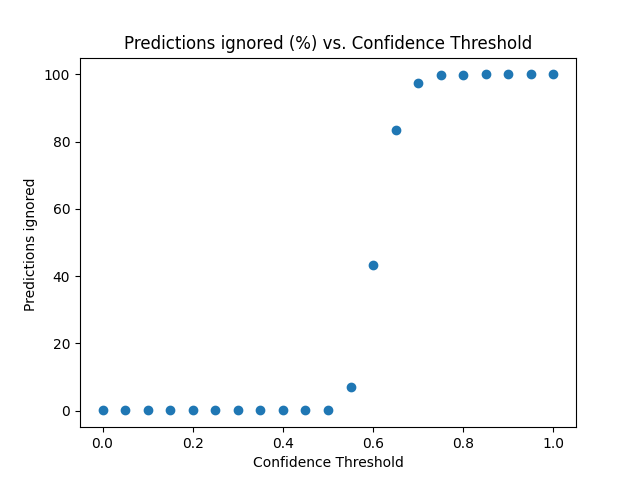

# Benchmark results 

## Deepstack command 
docker run -e VISION-DETECTION=True -e VISION-FACE=True -v localstorage:/datastore -p 80:5000 deepquestai/deepstack

Make sure to edit the GLOBAL variables in the notebook if the deepstack command is different (i.e -p is set for anything other than 80:5000)

**Warning**: Running this benchmark will delete all the saved faces in the deepstack

# Benchmarks 

Note: Since the faces are already croped, only the best prediction for each photo is taken into account

## Family-wide benchmark

The most likely scenario is using the software in a family of 3-5 people 
To simulate this, I trained 4 individuals using a variable number of photos and then tried to perform recognition. 

I also checked what was the performance using photos from new individuals

### Pipeline 

- Step 1 - Pick 4 random individuals, and train deepstack to recognize them (with a variables number of images)
- Step 2 - Test using photos from the same individuals. The prediction is correct if the predicted and the test label are the same
- Step 3 - Compute metrics (Explained below)
- Step 4 - Test on 100 photos of new individuals (not registered). In this case a correct prediction would be one where there is not a predicted face (using a treshold)
- Step 5 - Delete trained faces and repeat the process 25 times

Accuracy = (TP + TN) / (TP + TN + FP + FN)
Precision = TP / (TP + FP)
Recall = TP / (TP + FN)
F1-Score = 2 * (precision * recall) / (precision + recall)

### Training using one photo

Use only one photo per person: 

Histogram of correct vs histogram of incorrect confidance

Metrics with increasing confidance 

<table>
  <tr>
    <td></td>
    <td></td>
  </tr>
 </table>

(Other metrics are avaiable in the report figure)

### Training using Five photos

Use five photo per person: 

!Histogram of correct vs histogram of incorrect confidance

Metrics with increasing confidance 

<table>
  <tr>
    <td></td>
    <td></td>
  </tr>
 </table>

(Other metrics are avaiable in the report figure)

### Training using 15 photos

Using 15 photo per person to train

!Histogram of correct vs histogram of incorrect confidance

Metrics with increasing confidance 

<table>
  <tr>
    <td></td>
    <td></td>
  </tr>
 </table>

(Other metrics are avaiable in the report figure)

| Model                  	| One photo - min_confidance = 0 	| One photo - min_confidance = 0.6 	| One photo - min_confidance = 0.8 	| Five photo - min_confidance = 0 	| Five photo - min_confidance = 0.62 	| Five photo - min_confidance = 0.82 	| 15 photo - min_confidance = 0 	| 15 photo - min_confidance = 0.6 	| 15 photo - min_confidance = 0.8 	|
|------------------------	|--------------------------------	|----------------------------------	|----------------------------------	|---------------------------------	|------------------------------------	|------------------------------------	|-------------------------------	|---------------------------------	|---------------------------------	|
| Accuracy               	| 0.840                          	| 0.870                            	| 1                                	| 0.792                           	| 0.847                              	| 1                                  	| 0.804                         	| 0.857                           	| 1                               	|
| F1-score               	| 0.830                          	| 0.863                            	| 1                                	| 0.777                           	| 0.840                              	| 1                                  	| 0.794                         	| 0.853                           	| 1                               	|
| Precision              	| 0.877                          	| 0.870                            	| 1                                	| 0.799                           	| 0.847                              	| 1                                  	| 0.804                         	| 0.857                           	| 1                               	|
| Recall                 	| 0.840                          	| 0.89                             	| 1                                	| 0.792                           	| 0.868                              	| 1                                  	| 0.836                         	| 0.882                           	| 1                               	|
| prediction ignored (%) 	| 4.5                            	| 11.25                            	| 85.5                             	| 0                               	| 16.2                               	| 93.6                               	| 0                             	| 11.6                            	| 92.6                            	|

## Discussion 

- There are some limitations in this benchmark: Photos are pre-cut, meaning that we are not testing the capabilities of the algorithm to capture the face itself, only to identify. 
- No care was taken in relation to different etnic groups

## Conclusions 

Training with more images has a marginal effect on the performance with high cutoffs (0.6-0.8)
Applying a cuttoff is advised, if we are trying to prioritize not capturing people unknown 
